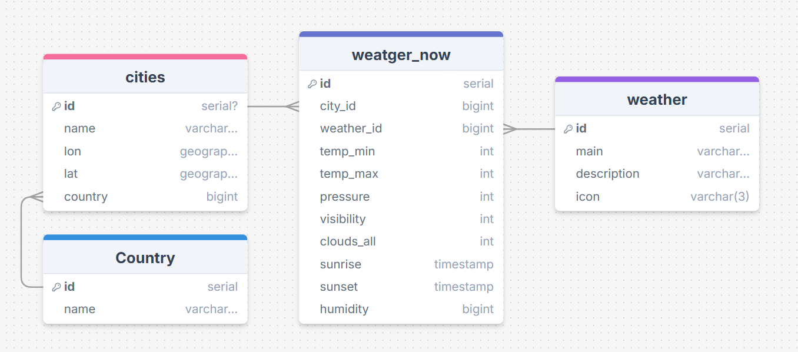

# 🌤️ Weather Data Pipeline Russia

Hello everyone. This is a pet project data pipeline for collecting weather data from various locations across Russia.

# Status
Currently in development stage

## Tools
- Python 3.12
- Docker Compose
- Airflow
- Polars
- Postgres

## About the Author
I am currently learning data engineering and periodically work on projects like this.

## Database

Я использую реалиционную базу данных Postgres для хранения данных о погоде.

### Tables
I have a four tables.

- **cities**
This table contains information about the cities I use to fetch weather data.
For example: name and coordinates.

- **weather_conditions**
This table contains information about types of weather conditions, such as clouds, rain, snow, etc.

- **weather_observations**
This table contains information about weather observations, such as temperature, pressure, humidity, etc. 
Current weather.

- **Country**
This table contains information about countries.

## License
Distributed under the [MIT License](https://en.wikipedia.org/wiki/MIT_License)