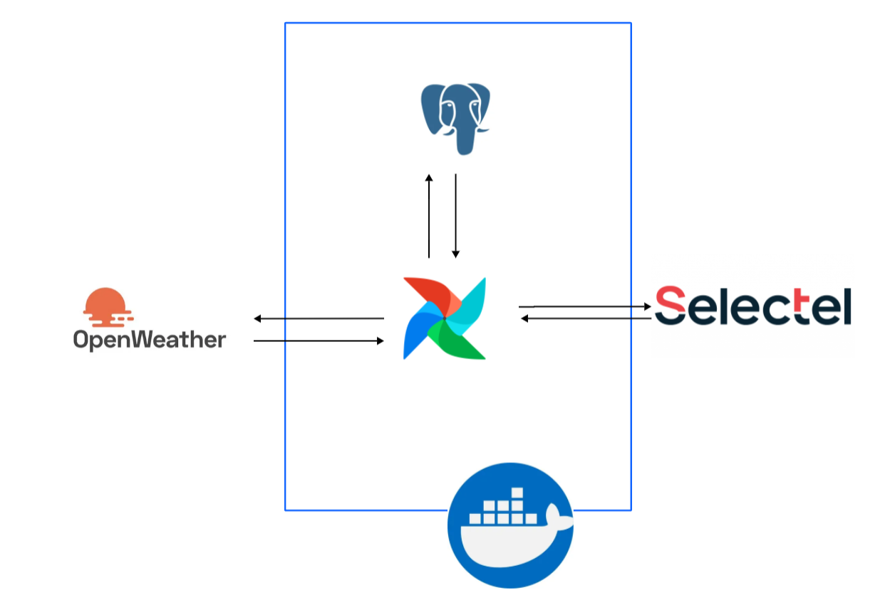

# 🌍 Global Weather Data Pipeline
[](https://www.python.org/)
[](https://www.docker.com/)
[](https://en.wikipedia.org/wiki/MIT_License)
[](https://airflow.apache.org/)

**Data pipeline for collecting, storing, and archiving global weather data from cities worldwide.**
Built as a learning project in **data engineering**, it demonstrates:
✔ **ETL orchestration** with Airflow
✔ **Scalable architecture** (Docker, PostgreSQL, S3)
✔ **Extensible database schema** (add cities/countries in 1 query)
✔ **Parallel data ingestion** (concurrent API calls)
✔ **Automated archiving** (Parquet → S3)

> 💡 **Not production-ready**, but designed with real-world practices: modularity, observability, and cloud readiness.

 

## 🚀 Quick Start
1. Clone the repo:
   ```bash
   docker-compose up -d
   ```

   ```bash
   git clone https://github.com/George-Mironenko/weather_data_russia.git
   cd weather_data_russia
   ```

2. Set up environment variables (`.env` file):
   ```ini
   POSTGRES_USER=your_user
   POSTGRES_PASSWORD=your_password
   OPENWEATHER_API_KEY=your_api_key
   SELECTEL_ACCESS_KEY=your_key
   SELECTEL_SECRET_KEY=your_secret
   SELECTEL_ENDPOINT=your_endpoint
   ```
3. Launch with Docker:
   ```bash
   docker-compose up -d
   ```
4. Access Airflow at `http://localhost:8080` (default credentials: `airflow/airflow`).

---

## 🏗️ Architecture Overview
### Core Components
| Component          | Role                                                                 |
|--------------------|----------------------------------------------------------------------|
| **Apache Airflow** | Orchestrates DAGs for data ingestion, archiving, and monitoring.   |
| **PostgreSQL**     | Stores structured weather data (cities, observations, metadata).  |
| **OpenWeather API**| Source of real-time weather data for global cities.                 |
| **Selectel S3**    | Long-term storage for archived data (Parquet format).               |
| **Docker**         | Containerized environment for local development.                   |

### Key Features
- **Dynamic City Management**: Add/remove cities via PostgreSQL (no code changes).
- **Parallel Ingestion**: Concurrent API calls for efficiency.
- **Automated Archiving**: Monthly exports to S3 in columnar format (Parquet).
- **Extensible Schema**: Supports global cities (not just Russia).

---

## 🗃️ Database Schema

 


| Table                  | Description                                                                 |
|------------------------|-----------------------------------------------------------------------------|
| **`cities`**           | Metadata: `id`, `name`, `latitude`, `longitude`, `country_id`.            |
| **`countries`**        | Reference: `id`, `name`, `iso_code` (e.g., "RU", "US").                   |
| **`weather_conditions`**| Lookup: `id`, `condition_code`, `description` (e.g., "rain", "clear").    |
| **`weather_observations`**| Facts: `id`, `city_id`, `condition_id`, `temperature`, `humidity`, etc.   |

> 📌 **Normalized design** minimizes redundancy and ensures integrity.

---

## 🔄 Data Pipeline
### 1. **City Discovery (Manual/Yearly)**
- Populate `cities` table via SQL:
  ```sql
  INSERT INTO cities (name, latitude, longitude, country_id)
  VALUES ('New York', 40.7128, -74.0060, (SELECT id FROM countries WHERE iso_code='US'));
  ```

### 2. **Weather Ingestion (Daily)**
- **DAG `ingest_weather`**:
  - Fetches cities from PostgreSQL.
  - **Parallel API calls** to OpenWeather for each city.
  - Stores results in `weather_observations`.
  - Logs errors for failed requests.

### 3. **Archiving (Monthly)**
- **DAG `archive_weather`**:
  - Exports previous month’s data to **Parquet**.
  - Uploads to **Selectel S3**.
  - Optionally purges old records from PostgreSQL.

---

## 🌐 Global Coverage
- **Not Russia-only**: The pipeline supports **any city worldwide**.
- **How to add a city**:
  1. Insert into `cities` table (see above).
  2. The next DAG run will automatically fetch its weather.

---

## 📈 Example Queries
### Top 5 Coldest Cities (Last 24h)
```sql
SELECT c.name, wo.temperature
FROM weather_observations wo
JOIN cities c ON wo.city_id = c.id
WHERE wo.observed_at > NOW() - INTERVAL '24 HOUR'
ORDER BY wo.temperature ASC
LIMIT 5;
```

### Monthly Archive (Parquet)
```python
import polars as pl
df = pl.read_parquet("s3://your-bucket/weather/2025-10.parquet")
print(df.filter(pl.col("temperature") < 0))  # Freezing locations
```

---

## 🛠️ Setup & Configuration
### Requirements
- Docker + Docker Compose
- Python 3.9+
- API keys: [OpenWeather](https://openweathermap.org/api), [Selectel S3](https://selectel.ru/)

### Environment Variables
| Variable               | Description                          |
|------------------------|--------------------------------------|
| `POSTGRES_USER`        | PostgreSQL username.                 |
| `OPENWEATHER_API_KEY`  | API key for weather data.           |
| `SELECTEL_ACCESS_KEY`  | Selectel S3 access key.              |

---

## 📂 Project Structure
```
weather_data_russia/
├── docker-compose.yml    # Airflow + PostgreSQL
├── dags/
│   ├── ingest_weather.py  # Main ETL DAG
│   └── archive_weather.py# Archiving DAG
├── scripts/
│   └── init_db.py         # DB schema setup
└── photo/                 # Diagrams (e.g., ERD)
```

---

## 🚧 Roadmap
- [ ] **Alerting**: Telegram notifications for extreme weather.
- [ ] **Dashboard**: Visualize trends (e.g., temperature maps).
- [ ] **Spark Migration**: For larger-scale processing.
- [ ] **CI/CD**: Automated testing/deployment.

---

## 🤝 Contributing
Pull requests welcome! Focus areas:
- **New data sources** (e.g., historical weather APIs).
- **Optimizations** (e.g., Airflow task grouping).
- **Documentation** (e.g., DAG graphs, setup guides).